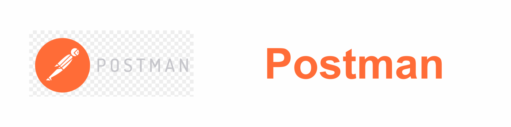
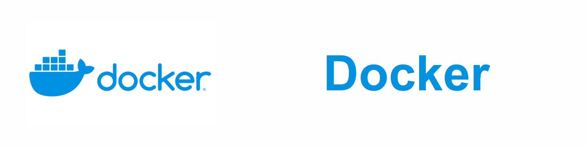
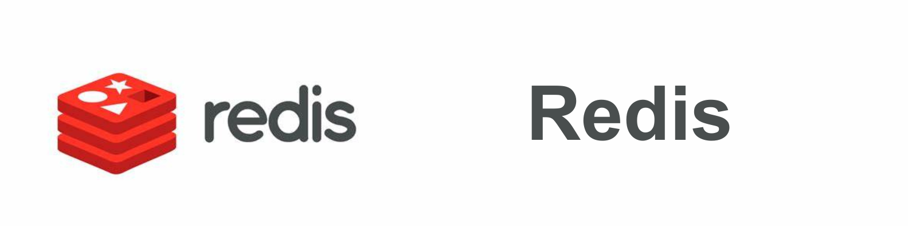
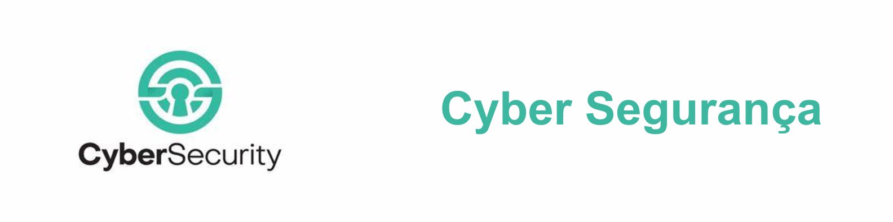
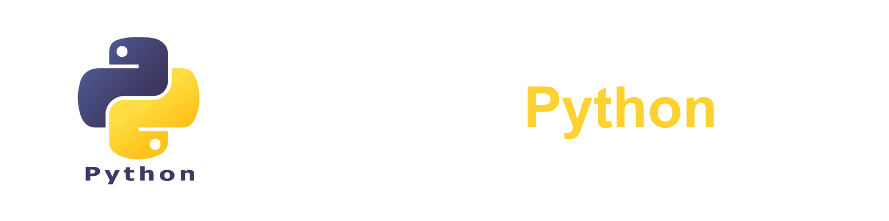
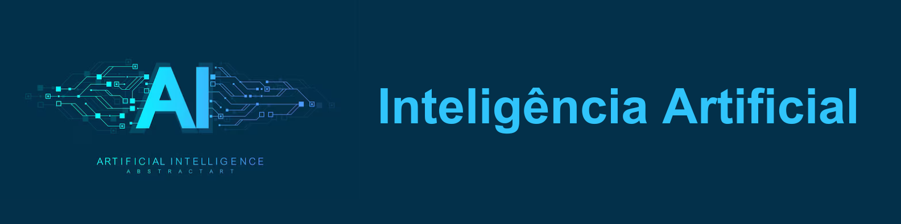

# Bem-vindo ao meu perfil do GitHub! 👋

Olá! Sou Wesley Rodrigues, um desenvolvedor web back-end apaixonado por transformar desafios complexos em soluções inovadoras.

Iniciei minha jornada no desenvolvimento web aos 15 anos e, desde então, venho explorando diversas tecnologias e frameworks para aprimorar minhas habilidades. Meu objetivo é me tornar um desenvolvedor de software completo, sempre buscando conhecimento e evolução contínua.

Acredito que a simplicidade, a eficácia e a disciplina são fundamentais para o sucesso de qualquer projeto. Estou sempre pronto para enfrentar novos desafios e contribuir para soluções que impactem positivamente pessoas e empresas.

## Sobre Mim

- 🌱 Atualmente, estou constantemente aprimorando meus conhecimentos e buscando aprender    novas tecnologias ou aprofundar meu conhecimento em áreas específicas. Meu processo de      aprendizagem está dividido em módulos que abrangem uma variedade de tópicos essenciais:

1. PHP
2. JavaScript
3. TypeScript
4. Banco de Dados
5. Segurança da Informação
6. Nuvem
7. Python
8. Java
9. Inteligência Artificial

- Estou comprometido em explorar cada módulo de maneira aprofundada para me tornar um profissional mais competente e versátil. Através desse aprendizado contínuo, busco estar sempre atualizado e preparado para enfrentar os desafios dinâmicos do mundo da tecnologia.

- 💻 Tenho especialização em PHP, Laravel, JavaScript, MySQL, phpMyadmin, SQL, HTML e CSS.
- 🚀 Estou constantemente buscando aprender mais e expandir meu conhecimento na área de desenvolvimento web.
- 🎯 Focado em me tornar um desenvolvedor full stack altamente competente e de relevância no mercado.

## Projetos Relevantes

- [Vacation Plan](https://github.com/WesleyRodriguesMoreira/Vacation_Plan-Buzzvel) - Em Andamento

## Projetos Futuros

- [Portfólio Inteligente](https://github.com/WesleyRodriguesMoreira/Portfolio_Inteligente)
- [Gremio SGGE](https://github.com/WesleyRodriguesMoreira/Gremio_SGGE)
- [Easy Pay](https://github.com/WesleyRodriguesMoreira/Easy_Pay)
- [Cyber Guardian](https://github.com/WesleyRodriguesMoreira/Cyber_Guardian)

## Tecnologias e Ferramentas

    
    
     
    
    
    
    
      

## Tecnologias e Ferramentas - em estudo

 - PHP
     
   
   
   
   

 - JavaScript
      
    
    
    
    
    
    
    
    

 - TypeScript
      
    
    

 - Banco de Dados
      
    
    
    
    
   

 - Segurança da Informação
      
    
    

 - Nuvem
      
    
    

 - Python
      
    

 - Java
      
    

 - Inteligência Artificial
      
    

## Entre em Contato

- [ 📫 Você pode me enviar um e-mail](wesley1912@gmail.com)
- [Baixar Currículo](assets/curriculo-Wesley.pdf)

