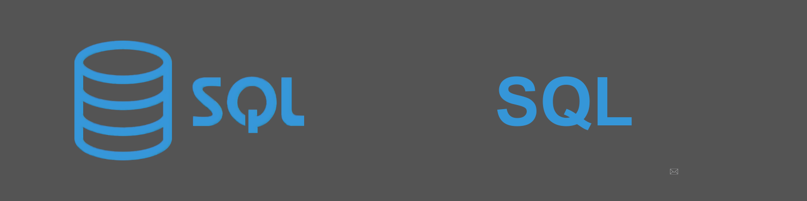
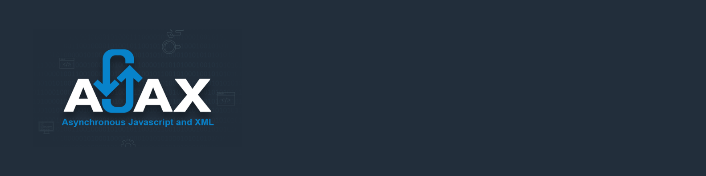
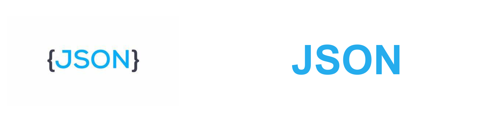
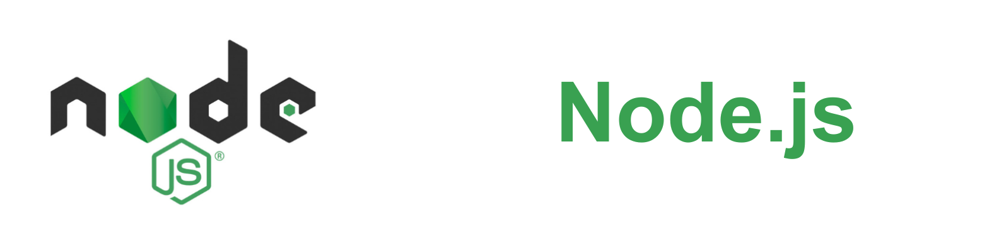

# Bem-vindo ao meu perfil do GitHub! 👋

Olá! Sou Wesley Rodrigues Moreira, um desenvolvedor web back-end apaixonado por criar soluções inovadoras para desafios complexos. Iniciei minha jornada na área de desenvolvimento web aos 15 anos e desde então tenho explorado uma variedade de tecnologias e frameworks para aprimorar minhas habilidades.

Com o objetivo de me tornar um desenvolvedor de software completo, estou em constante busca por conhecimento, especialmente em desenvolvimento front-end e mobile. Minha abordagem é sempre focada em simplicidade, eficácia e disciplina em todos os projetos que executo.

Estou entusiasmado para enfrentar novos desafios e contribuir para projetos que impactam positivamente as pessoas e as empresas.

## Sobre Mim

- 🌱 Atualmente, estou constantemente aprimorando meus conhecimentos e buscando aprender    novas tecnologias ou aprofundar meu conhecimento em áreas específicas. Meu processo de      aprendizagem está dividido em módulos que abrangem uma variedade de tópicos essenciais:

- PHP
- JavaScript
- TypeScript
- Banco de Dados
- Segurança da Informação
- Nuvem
- Python
- Java
- Inteligência Artificial

Estou comprometido em explorar cada módulo de maneira aprofundada para me tornar um profissional mais competente e versátil. Através desse aprendizado contínuo, busco estar sempre atualizado e preparado para enfrentar os desafios dinâmicos do mundo da tecnologia.

- 💻 Tenho especialização em PHP, Laravel, JavaScript, MySQL, phpMyadmin, SQL, HTML e CSS.
- 🚀 Estou constantemente buscando aprender mais e expandir meu conhecimento na área de desenvolvimento web.
- 🎯 Focado em me tornar um desenvolvedor full stack altamente competente e de relevância no mercado.

## Projetos Relevantes

- [Vacation Plan](https://github.com/WesleyRodriguesMoreira/Vacation_Plan-Buzzvel)-Em Andamento

## Projetos Futuros

- [Portfólio Inteligente](https://github.com/WesleyRodriguesMoreira/Vacation_Plan-Buzzvel)
- [Gremio SGGE](https://github.com/WesleyRodriguesMoreira/Vacation_Plan-Buzzvel)
- [Easy Pay](https://github.com/WesleyRodriguesMoreira/Vacation_Plan-Buzzvel)
- [Cyber Guardian](https://github.com/WesleyRodriguesMoreira/Vacation_Plan-Buzzvel)

## Tecnologias e Ferramentas

    
    
     
    
    
    
    
      

## Tecnologias e Ferramentas - em estudo

 - PHP

 - JavaScript
    
    
    
    
    
    
    
    

 - TypeScript
    
    

 - Banco de Dados
    
    
    
    

 - Segurança da Informação
 
    

 - Nuvem
 
    

 - Python
 
 - Java
 
 - Inteligência Artificial
 

## Estatísticas do GitHub

## Entre em Contato

- 📫 Você pode me enviar um e-mail
